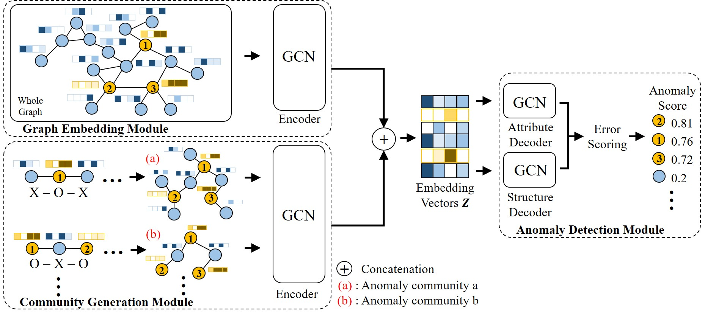

# MSAD
A PyTorch implementation of "[Deep Semi-supervised Anomaly Detection with Metapath-based Context Knowledge]" 

# Dependencies
  Dependencies for all experiments of MSAD are as follows:
  
   • Python == 3.7.8
   
   • PyTorch == 1.6.0
   
   • NetworkX == 2.6.3
   
   • Scikit-learn == 0.23.2
   
   • NumPy == 1.18.5
   
   • SciPy == 1.7.3
   

# Usage
All of datasets used in this paper are put in ./data folder and graph information (e.g., adjacency, attribute, and label) is included in each dataset file (.mat). Due to the large file size, some of metapaths are included in that folder as .csv files. Various metapath schema can be extracted by using
different metapath extractors. The meaning of filename is {dataset} {metapath schema} {anomaly ratio} {sampling round}.csv.

    python main.py --dataset cora

